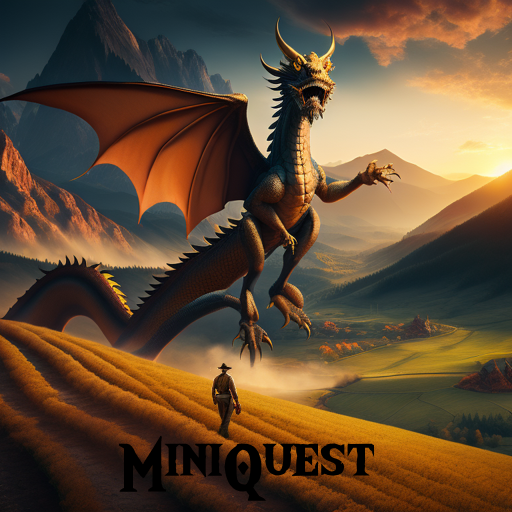
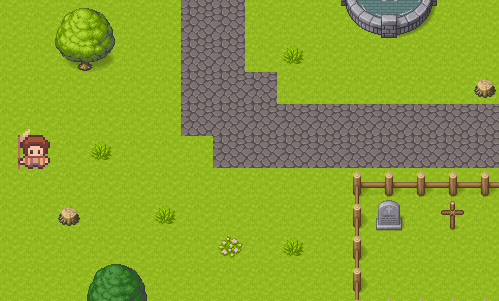
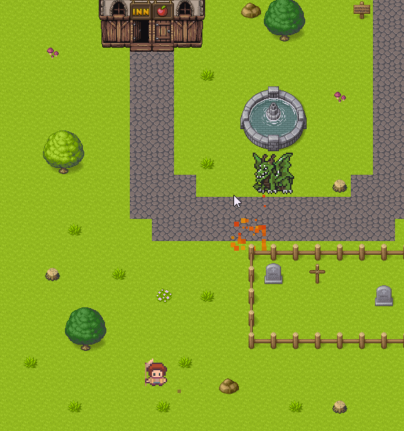
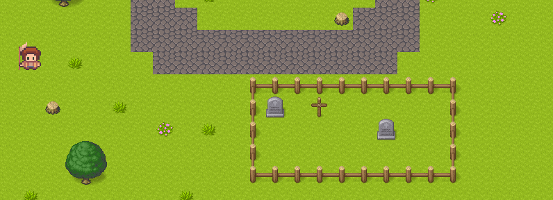
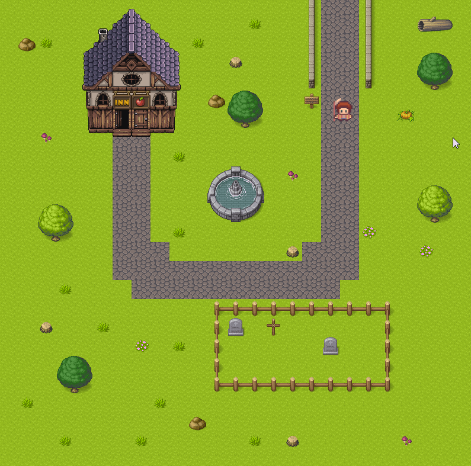
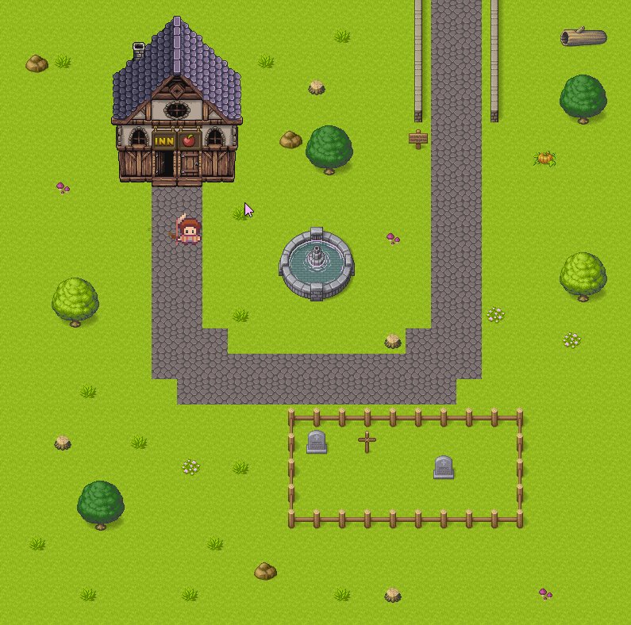
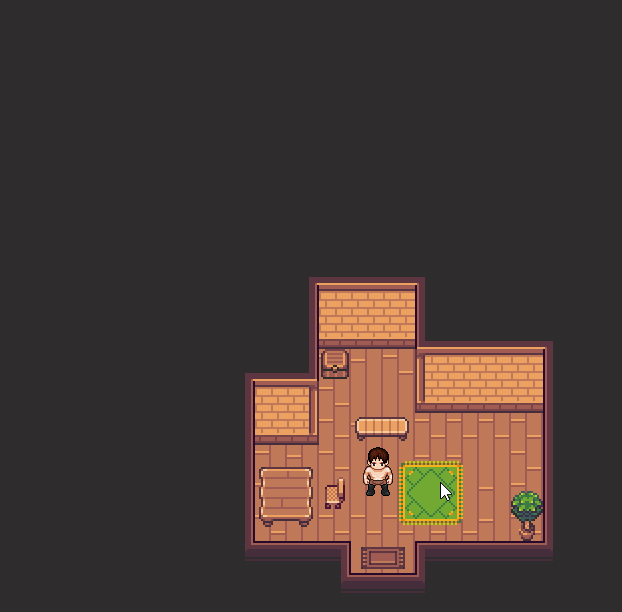
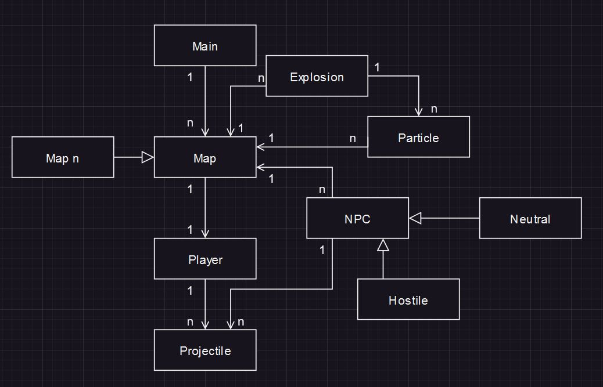

  

## About MiniQuest

Welcome to MiniQuest, a  top-down adventure game where  the journey is full of unexpected twists and turns. Play as a village farmer thrown into a heroic journey after a dragon attack devastates your peaceful life. Brace yourself for an epic quest around the world to seek justice, explore the world, complete quests, collect items, discover secrets and make new allies.

Discord: https://discord.gg/2jxRmm8j3Q

## Gameplay
### Mechanics
The player can interact with the world in various ways. MiniQuest features multiple maps, which the player can traverse and explore. Each map has its own quests, enemies, loot, puzzles and much more. Players will be able to interact with objects around the world. For example, a player may be able to access chests, reads signs, talk to NPCS, cast spells, complete quests and slay monsters.

### Controls
The player can move their character using the WASD keys. W moves the character forward, A moves them left, S moves them backward, and D moves them to the right. 

The player can attack enemies by left-clicking the screen. The type of attack performed depends on the weapon the character is currently holding. For example, a sword might trigger a slashing motion, while a bow would release an arrow towards the cursor.

The E key is used for interactions. This includes opening chests, entering doors, reading signs, and initiating conversations with NPCs.
 
The player can access their inventory and game menus by pressing the TAB and Esc keys, respectively. In the inventory, players can equip new items, use consumables, and view their character's stats and abilities. The game menu provides access to options such as saving and loading the game, adjusting settings, and exiting to the desktop.

### Level Design
MiniQuest employs a sprawling world map that consists of multiple, distinct smaller maps, each featuring its own unique environment, challenges, and storylines. The player's journey will lead them through a variety of landscapes - from verdant forests and treacherous mountains, to bustling towns and eerie dungeons.

The world map is vast and interconnected, fostering a sense of a continuous, cohesive world. Some areas are easily accessible from the beginning, inviting early exploration, while others are gated by story progress, character abilities, or challenging enemies, rewarding players for growth and progression. Some maps may be secret and hidden, not explicitly being told to the player. 

Each map is designed with its own unique layout, aesthetic, and theme. Areas may include a variety of terrains and points of interest, such as natural landmarks, NPC hubs, enemy encampments, secret paths, and treasure caches. This variety encourages thorough exploration and offers diverse gameplay experiences.

Certain areas have "inner maps" or "interiors", such as houses, castles, or dungeons. These interior maps often feature puzzles, quests, or enemies that are specific to that location. For example, a dungeon might be filled with traps and monsters, while a castle may contain political intrigue and quests. Interiors serve to deepen the world's lore, provide context to its inhabitants, and offer a change of pace from the outside world.

The maps are handcrafted using TileMaps. Each tile represents a piece of the environment - such as a patch of grass, a piece of wall, or a section of river - and can be combined with others to create intricate, varied landscapes. Each map features multiple layers, including collision layers to prevent players from walking through solid objects, ground layers to create the basic terrain, and above-ground layers to add details and depth.

The world will feature a day/night cycle and a weather system. 

### Character Progression
At the start of the game, the player begins as a humble farmer, starting at level one with only basic tools and no combat abilities.

The world of MiniQuest is filled with hidden treasures, special items, and powerful equipment. As the player explores, they will find weapons to increase their combat abilities, armor to protect them from damage and artifacts with special effectss. Some items will be straightforward to find, while others will require solving challenging puzzles, defeating powerful enemies, or completing complex quests.

Over the course of their journey, the player will encounter a variety of non-player characters (NPCs). Interacting with these characters can lead to new quests, access to special items, or even companionship. Building relationships with NPCs can allow the player to gain them as followers, or unlock new story line narratives and quests.

## Story and Characters
### Plot
The tranquility of our protagonist's life as a humble farmer is shattered when a devastating dragon attack razes the village, claiming the lives of loved ones and leaving destruction in its wake. Overcome with grief and anger, the protagonist vows to seek revenge against this monstrous adversary, setting them on a globe-trekking journey that will challenge their resolve, forge new friendships, and unveil truths that will shake them to their very core.

Throughout the journey, the protagonist's choices will steer the narrative, influencing relationships with characters, altering the progression of major events, and even leading to different game endings. MiniQuest's story thus evolves as a deeply personal and interactive narrative that binds the protagonist's growth and experiences with the player's actions and decisions.

### Characters
The protagonist begins their journey as an everyday farmer, thrust into a hero's path by the hands of fate. As the player character, the protagonist's personality, abilities, and destiny are shaped by player choices and actions throughout the game.

The primary antagonist of MiniQuest, this beast's unexpected attack on the protagonist's village sets the game's events into motion. The dragon's motives and origins are shrouded in mystery, providing a compelling focal point for the protagonist's quest for revenge.

MiniQuest is enriched with a diverse cast of supporting characters, each with their own personalities, backgrounds, and roles within the story. From wise mentors and loyal allies to cunning adversaries and enigmatic strangers, these characters infuse the world with life and narrative depth.

## Art and Sound
### Visual Style
The visual style of MiniQuest is reminiscent of classic 16-bit RPGs, offering a modern take on nostalgic aesthetics. The pixel art design, though simplistic, is rich in detail and character. Each environment, character, and object in the game is carefully crafted, adding depth and personality to the game world. The player, enemies, npcs and more will be fully animated in the four cardinal directions.

### Sound
The soundtrack, featuring orchestral arrangements with elements of folk and fantasy music, sets the emotional tone for the game. Each area has its own unique theme, helping to differentiate them and enhance the feeling of journeying through a vast, diverse world.

Sound effects are crisp and satisfying, providing immediate feedback for the player's actions. The clashing of swords, the casting of spells, the chimes when a quest is completed - all these sounds contribute to making the game world feel tangible and responsive.

The ambient sounds further enhance immersion, with the chirping of birds in the forests, the bustle of towns, or the eerie echoes in a dungeon. These sounds breathe life into the world, making it feel like a living, breathing entity.

## Technical
### Platforms
MiniQuest is initially being designed for the Windows platform. This choice allows us to focus our resources and testing on creating the best possible experience for a large user base. As the game evolves, we will consider expanding to additional platforms based on player demand and feasibility.

### Game Engine and Language
MiniQuest is developed using the Pygame CE library, a set of Python modules designed for game creation. It provides the functionality required for game development, including graphics, sound, and input handling, making it an ideal choice for MiniQuest's development.

We chose Python as our programming language due to its readability, simplicity, and vast standard library. Python is well-suited for quickly prototyping and iterating on game concepts, which aligns with our agile approach to game development.

For designing our game's world, we are utilizing Tilemaps. This method allows us to create complex, grid-based environments efficiently and effectively. It's a widely used technique in 2D game development, particularly in creating RPGs like MiniQuest, and provides us the flexibility we need in creating diverse and engaging levels.

## Timeline and Milestones
### Pre-Production (June 2023)
- Conceptualization and design of game's mechanics, story, characters, and art style.
- Plan and design the project with class diagrams and specifications.

### Prototype Development (June 2023 - July 2023)
- Develop a basic playable prototype featuring core gameplay mechanics, such as player movement, basic combat, and interaction with the game world.
- Establish a solid foundation for the game's code, incorporating good software design practices and clean code principles.

### Alpha Development (July 2023 - TBD)
- Develop the first complete version of the game, also known as the alpha version.
- This version should include all major game systems and mechanics, basic art assets, and a significant portion of the game's content.
- Continue playtesting and start to gather broader feedback on the game's design and balance.

### Beta Development (TBD - TBD)
- Polish the game, fix bugs, and implement final assets, including art, sound, and music.
- Optimize the game for the best performance.
- Continue playtesting with a broader audience to find and fix as many bugs as possible.

### Release (TBD)
- Launch the final version of the game.
- Monitor for any immediate issues that need to be addressed.
- Begin post-launch support, including fixing any additional bugs and potentially starting work on additional content or features based on player feedback.

### Post-Release (TBD)
- Monitor the game for bugs
- Fix any issues that arise

## Progress Over Time
  
  
  
  
  
  

https://github.com/harrybridgen/MiniQuest/assets/105605342/45db2253-14c6-42b1-a8cb-79d0bdb87637

https://github.com/harrybridgen/MiniQuest/assets/105605342/c2860954-feff-458f-9843-fbd677877c33

https://github.com/harrybridgen/MiniQuest/assets/105605342/d66dbd86-7858-4f91-97ed-2e469900539f

## Proposed Class Diagram

  

